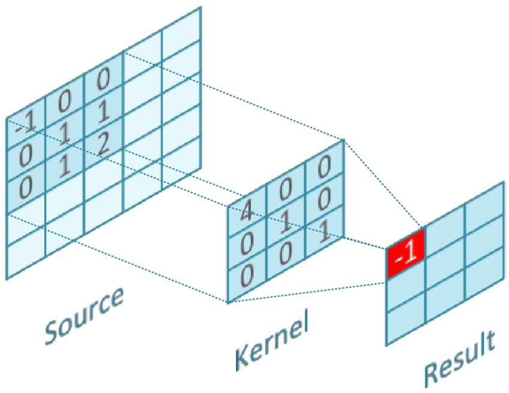

# How Filters Work

## Introduction

---

O que a palavra filtros representa pra mim é diferente do que representa pra alguém que tem o costume de usar a câmera do Instagram ou Tiktok. Normalmente em um app, os filtros são uma combinação direta de low-level filters de vários tipos e intensidades, como mudanças de contraste, mudanças de cor, blurs, etc. Quando eu penso em filtros, penso em Gaussian Blurs, Edge Detection, mas no final das contas são todos filtros, independente da maneira que são montados, todos pegam uma imagem de entrada, processam e devolvem um output.

Nas aulas a seguir a gente vai aprender um pouco sobre Kernel Convolution, ou convolução com Kernel, de diversas maneiras diferentes, aplicando a função manualmente e até mesmo entendendo como a função matemática descreve a transformação da imagem, de maneira a qual saibamos o que de fato faz um low-level filter. Não é necessário um vasto conhecimento matemático para o entendimento das aulas a seguir, mas recomendo que se crie o hábito de pausar e entender de fato o raciocínio lógico que está sendo explicado.

Lembrando que em representações de matrizes, imagens são formadas por matrizes tridimensionais, formadas por canais de cor diferente, geralmente representados como RGB (red, green, blue), BGR (blue, green, red) e CMYK (cyan, magenta, yellow, black) que é mais utilizado para imagens de impressão

## Kernel Convolution Process

---

**Kernel**: No processamento de imagem, um kernel, matriz de convolução ou máscara é uma pequena matriz usada para desfoque, nitidez, relevo, detecção de borda e muito mais.

O kernel é colocado sobre cada pixel da imagem e o pixel está no centro. Os valores no kernel são multiplicados pelos valores de imagem correspondentes, somados e depois normalizados para evitar alterações no brilho.



Então se tu for pra qualquer software de edição de imagem como Photoshop e escolher um blur, o processo que será feito é o de Kernel Convolution.

Lidar com pixels de borda na convolução do kernel requer decisões como ignorá-los ou aplicar uma média menor nos cantos para minimizar o desfoque nas bordas da imagem.

## Gaussian Blur

---

**Curva Gaussiana/Distribuição Normal**: O gráfico de uma Gaussiana é uma característica simétrica "curva do sino" forma que rapidamente cai para o infinito mais / menos.


São exemplos de matrizes gaussianas:

```python
np.array([[1, 2, 1],
          [2, 4, 2],
          [1, 2, 1]])
```

Assim como:

```python
np.array([[1, 4, 6, 4, 1],
          [4, 16, 24, 16, 4],
          [6, 24, 36, 24, 6],
          [4, 16, 24, 16, 4],
          [1, 4, 6, 4, 1]])
```


## Box Blur

---

Um Box Blur é um filtro linear de domínio espacial no qual cada pixel na imagem resultante tem um valor igual ao valor médio de seus pixels vizinhos na imagem de entrada.

É um processo extremamente semelhante ao Gaussian Blur, a única diferença é que a matriz do Box Blur é uniforme, com valores = 1 para todas as células

```python
np.array([[1, 1, 1],
          [1, 1, 1],
          [1, 1, 1]])
```


